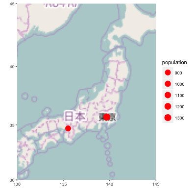

<!--
%\VignetteEngine{knitr::knitr}
%\VignetteIndexEntry{Plotting Geospatial Data}
-->

```{r global_options, include=FALSE}
library(knitr)
opts_chunk$set(fig.width=3, fig.height=3, fig.path='figures/map-', warning=FALSE)
```

This document explains plotting geospatial data using `ggplot2` and `{ggfortify}`. 

# Plotting with ``{maps}`` package

`{ggplot2}` can load map data provided by ``{maps}`` and ``{mapdata}`` package via ``map_data`` function. Loaded data is automatically converted to ``data.frame``, thus you can plot maps via ``ggplot`` as below.

```{r, message = FALSE}
library(mapdata)
library(ggplot2)

jp <- ggplot2::map_data('world2', 'japan')
class(jp)
head(jp)
ggplot(jp, aes(x = long, y = lat, group = group)) +
  geom_polygon()
```

``{ggfortify}`` additionally allows to ``autoplot`` ``map`` instances as it is. You can specify ``geom`` and other options to controll the outlooks.

```{r, message = FALSE}
library(ggfortify)
jp <-  map('world2', 'japan', plot = FALSE, fill = TRUE)
class(jp)
autoplot(jp)

p <- autoplot(jp, geom = 'polygon', fill = 'subregion') + 
  theme(legend.position="none")
p
```

Also, ``maps`` package provides some geospatial data. Following example retrieves Japanese city locations from world's city locations. Then plot on the previous map.

```{r, message = FALSE}
cities <- get('world.cities')
cities <- cities[cities$country.etc == 'Japan', ]
head(cities)

p + geom_point(data = cities, aes(x = long, y = lat),
               colour = 'blue', size = 0.1)
```

Because map plot created by ``{ggfortify}`` has a setting of ``aes(x = long, y = lat)``, you don't have to specify ``x`` and ``y`` aethetics in this case.

```{r, message = FALSE}
p + geom_point(data = cities, colour = 'blue', size = 0.1)
```

# Plotting with ``{sp}`` package

Also, ``{ggfortify}`` can supports geospatial instances defined in ``{sp}`` package. Actually some functions are defined in ``{ggplot2}``. Following table shows where each function is defined. 

class                          | ``fortify``     | ``autoplot``
-------------------------------|-----------------|----------------
``Line``                       | ``{ggplot2}``   | ``{ggfortify}``
``Lines``                      | ``{ggplot2}``   | ``{ggfortify}``
``Polygon``                    | ``{ggplot2}``   | ``{ggfortify}``
``Polygons``                   | ``{ggplot2}``   | ``{ggfortify}``
``SpatialLines``               | ``{ggfortify}`` | ``{ggfortify}``
``SpatialLinesDataFrame``      | ``{ggplot2}``   | ``{ggfortify}``
``SpatialPoints``              | ``{ggfortify}`` | ``{ggfortify}``
``SpatialPointsDataFrame``     | ``{ggfortify}`` | ``{ggfortify}``
``SpatialPolygons``            | ``{ggplot2}``   | ``{ggfortify}``
``SpatialPolygonsDataFrame``   | ``{ggplot2}``   | ``{ggfortify}``

Following example creates ``SpatialPointsDataFrame`` of some Japanese city's populatios, then plot it via ``autoplot``. Note that you ``geom`` is specified by the original ``{sp}`` class. ``SpatialPoints`` is plot using ``geom_point`` for example.

```{r, message = FALSE}
library(sp)
df <- data.frame(long = c(139.691704, 135.519711),
                 lat = c(35.689521, 34.686316),
                 label = c('Tokyo', 'Osaka'),
                 population = c(1335, 886))
coordinates(df) <- ~ long + lat
class(df)
autoplot(df, p = p, colour = 'red', size = 10)
```

Also, you can use other columns as aethetics.

```{r, message = FALSE}
autoplot(df, p = p, colour = 'red', size = 'population') +
  scale_size_area()
```

# Plotting with other packages

``autoplot`` has ``p`` keyword to take existing ``ggplot`` instance. Below example plots ``SpatialPointsDataFrame`` on the ``ggmap``.

```{r, message = FALSE, eval = FALSE}
library(ggmap)
bbox <- c(130.0, 30.0, 145.0, 45.0)
map <- get_openstreetmap(bbox = bbox, scale = 47500000)
p <- ggmap(map)
autoplot(df, p = p, colour = 'red', size = 'population') + 
  scale_size_area() +
  theme(legend.justification = c(1, 0), legend.position = c(1, 0))
```


